# 2023-2024 : Capteur low-tech Graphite (Tan Anh Khoa NGO &amp; Le Duc Minh TRAN)

## SOMMAIRE
*** 
  - [Contexte](#contexte)
  - [Livrables](#livrables)
  - [Matériel nécessaire](#matériel-nécessaire)
  - [1. Simulation électronique du capteur sous LTSpice](#simulation-électronique-du-capteur-sous-ltspice)
  - [2. Design du PCB sous KiCad](#design-du-pcb-sous-kicad)
  - [3. Code arduino](#code-arduino)
  - [4. Application android APK sous MIT App Inventor](#application-android-apk-sous-mit-app-inventor)
  - [5. Réalisation du shield](#réalisation-du-shield)
  - [6. Banc de test](#banc-de-test)
  - [7. Datasheet](#datasheet)
  - [Contact](#contact) 
  

*** 

## Contexte
&nbsp;&nbsp;&nbsp;&nbsp;&nbsp;&nbsp;Dans le cadre de l'unité de formation "Du capteur au banc de test" dispensée en 4ème année du cursus Génie Physique à l'INSA Toulouse, notre équipe a conçu un dispositif de mesure de contrainte innovant. L'inspiration pour le capteur de ce dispositif provient de l'article scientifique "Pencil Drawn Strain Gauges and Chemiresistors on Paper" (Cheng-Wei Lin*, Zhibo Zhao*, Jaemyung Kim & Jiaxing Huang). Ce capteur, d'une simplicité remarquable, est constitué d'un morceau de papier sur lequel du graphite est appliqué à l'aide d'un crayon à papier. 

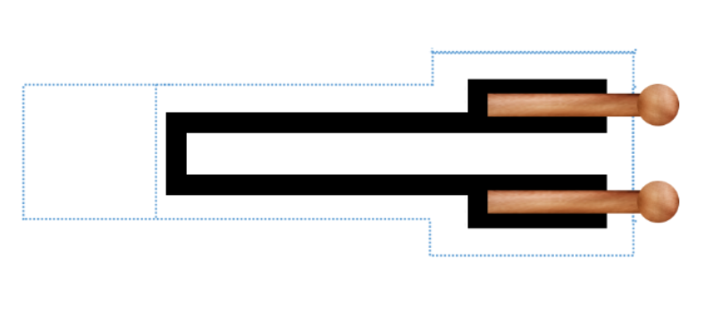

&nbsp;&nbsp;&nbsp;&nbsp;&nbsp;&nbsp;Le principe de fonctionnement repose sur l'observation que la déformation du papier entraîne une variation du nombre de particules de graphite interconnectées. Cette modification de la structure granulaire du graphite se traduit par une variation de la résistance et de la conductance du capteur. En exploitant cette propriété, il devient possible de remonter à la déformation subie, à l'instar d'une jauge de contrainte classique.

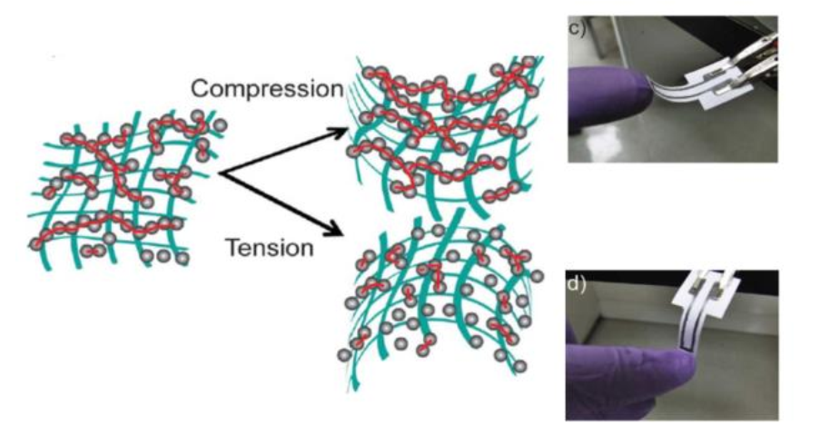

&nbsp;&nbsp;&nbsp;&nbsp;&nbsp;&nbsp;Notre objectif principal était de développer un dispositif de mesure de déformation basé sur un capteur low-tech. Pour atteindre cet objectif, nous avons suivi une démarche structurée comprenant plusieurs étapes clés : simulations électroniques pour valider le concept, conception du circuit imprimé (PCB) pour intégrer le capteur, développement du code Arduino pour l'acquisition et le traitement des données, et enfin, réalisation de la fiche technique du dispositif.

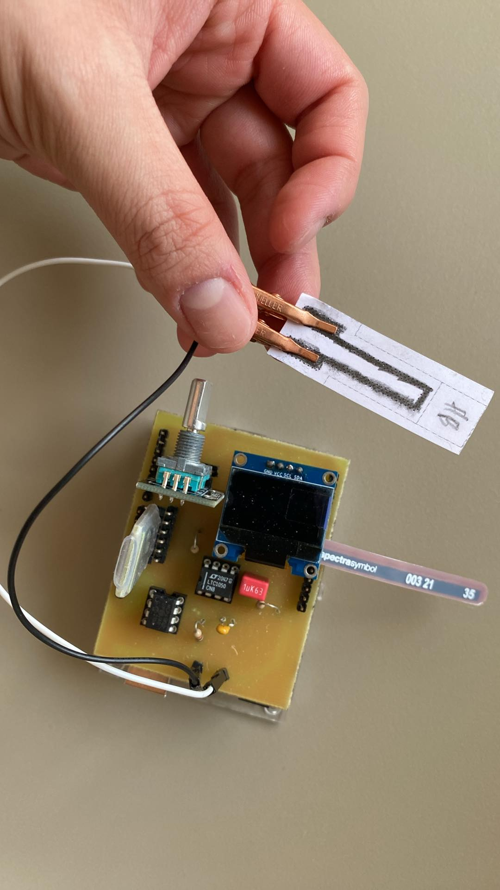

## Livrables
Les livrables de ce projet sont les suivants :
  
* Un shield PCB personnalisé connecté à une carte Arduino UNO. Ce shield intègre :
     
   - Un capteur de contrainte innovant à base de graphite.
   - Un amplificateur à transimpédance pour traiter le signal du capteur.
   - Un module Bluetooth pour la communication sans fil.
   - Un écran OLED pour l'affichage des données (ajouté pour améliorer l'expérience utilisateur).
   - Un capteur de flexion commercial pour comparaison (ajouté à des fins de validation).
   - Un potentiomètre numérique pour ajuster le gain de l'amplificateur (ajouté pour plus de flexibilité).
   - Un encodeur rotatif pour basculer entre les mesures des capteurs (ajouté pour faciliter la comparaison).
  
* Code Arduino     
   - L'acquisition des mesures de contrainte du capteur graphite.
   - La connexion et la communication Bluetooth.
   - L'affichage des données sur l'écran OLED.
   - Le réglage du gain via le potentiomètre numérique.
   - La sélection du capteur actif avec l'encodeur rotatif.
   - Réaliser des essais de banc de test rigoureux.
   - Évaluer les performances du capteur de contrainte graphite.
  
* Une application Android intuitive (APK) (développée avec MIT App Inventor) qui :
   - Permet de visualiser les données en temps réel.
   - Offre une interface conviviale pour interagir avec le système.

* Une datasheet complète qui détaille :
   - Les caractéristiques techniques du capteur graphite.
   - Son principe de fonctionnement.
   - Les instructions d'utilisation et de calibration.
   - Les résultats des tests de performance.

## Matériel nécessaire
Pour réaliser notre dispositif électronique, voici la liste des composants nécessaires :

- Résistances : 1 de 1 $k\ohm$, 1 de $10k\ohm$, 2 de $100k\ohm$ pour l'amplificateur transimpédance. 3 de $10k\ohm$ pour les boutons (peuvent être éviter en utilisant les résistances internes de l'arduino) et 1 de $33k\ohm$ pour le flex sensor.
- Capacités : 3 de 100 nF, 1 de 1 uF
- Arduino Uno
- Amplificateur opérationnel LTC1050
- Potentiomètre digital MCP41050
- Module Bluetooth HC05
- Ecran OLED 128x64
- Flex Sensor
- Encodeur rotatif KY-040

## Simulation électronique du capteur sous LTSpice
&nbsp;&nbsp;&nbsp;&nbsp;&nbsp;&nbsp;Pour amplifier le signal de notre capteur de graphite, caractérisé par une résistance élevée et un courant de sortie faible, nous avons conçu un montage à transimpédance. Ce montage, basé sur un amplificateur opérationnel (AOP), permet de convertir le faible courant en une tension exploitable par le convertisseur analogique-numérique (ADC) de l'Arduino UNO. \
&nbsp;&nbsp;&nbsp;&nbsp;&nbsp;&nbsp;La conception du circuit a été simulée sur LTspice, en suivant un [schéma spécifique](Image/LTspice/schema_suggere.png). Le choix de l'AOP s'est porté sur le LTC 1050, reconnu pour sa capacité à gérer des courants d'entrée faibles et son faible offset de tension, garantissant ainsi la précision des mesures. Voici son schéma :

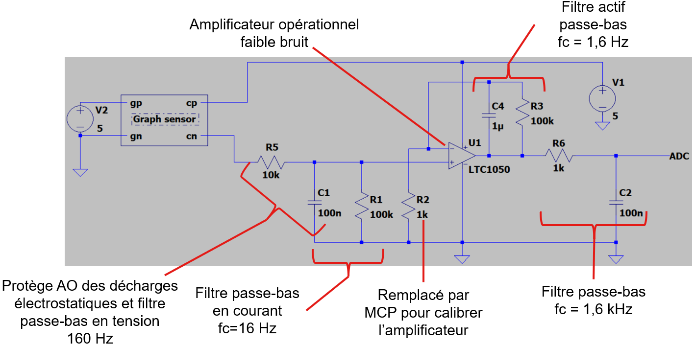

Afin d'optimiser la qualité du signal, trois filtres ont été intégrés au circuit :

- Un filtre passe-bas passif (R1, C1) à l'entrée, avec une fréquence de coupure de 16 Hz, pour atténuer les bruits en courant.
- Un filtre passe-bas actif (R3, C4) couplé à l'AOP, avec une fréquence de coupure de 1,6 Hz, pour filtrer le bruit à 50 Hz du réseau électrique.
- Un filtre passe-bas (R6, C2) à la sortie de l'AOP, avec une fréquence de coupure de 1,6 kHz, pour éliminer les bruits générés lors du traitement du signal.

De plus, des composants supplémentaires ont été ajoutés pour améliorer la robustesse du circuit :
- La capacité C3 pour filtrer le bruit de l'alimentation.
- La résistance R5 pour protéger l'AOP contre les décharges électrostatiques et former un filtre passe-bas avec C1 pour les bruits en tension.
- La résistance R2, qui sera remplacée par un potentiomètre numérique pour ajuster le gain de l'AOP selon les besoins.

Les tests effectués sur le circuit simulé ont confirmé l'efficacité des filtres.

Voici la réponse de notre circuit pour vérfier que le capteur soit correctement amplifié : 

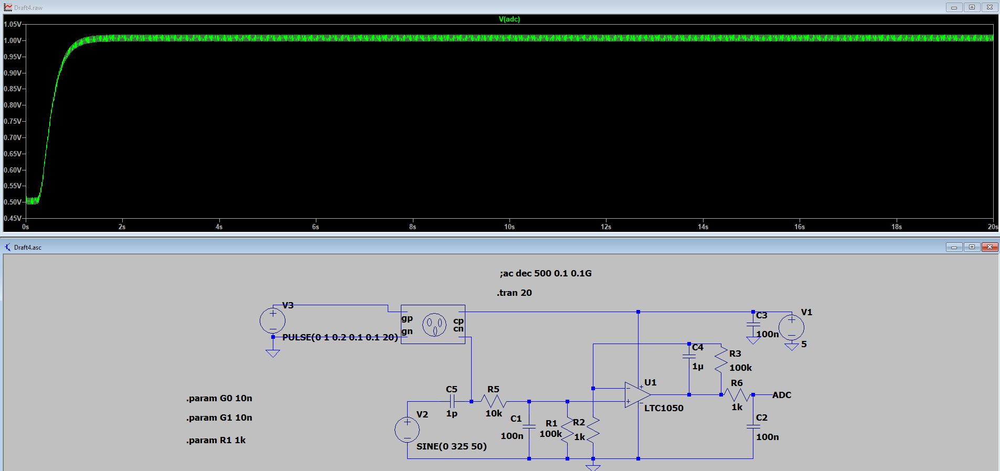
	
Le signal amplifié atteint 1V, une valeur compatible avec l'Arduino UNO.

De plus, la simulation d'un courant alternatif a démontré une atténuation significative du bruit, notamment une réduction d'environ 72 dB à 50 Hz.

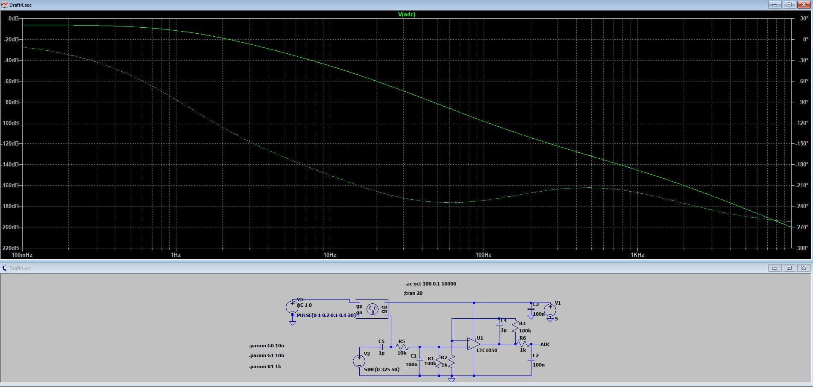

## Design du PCB sous KiCad

Pour développer notre circuit imprimé (PCB), nous avons utilisé le logiciel KiCad 7.0 et avons reproduit le schéma électrique initial, en y apportant quelques modifications. La résistance R2 a été remplacée par un potentiomètre numérique pour permettre le réglage du gain de l'AOP.

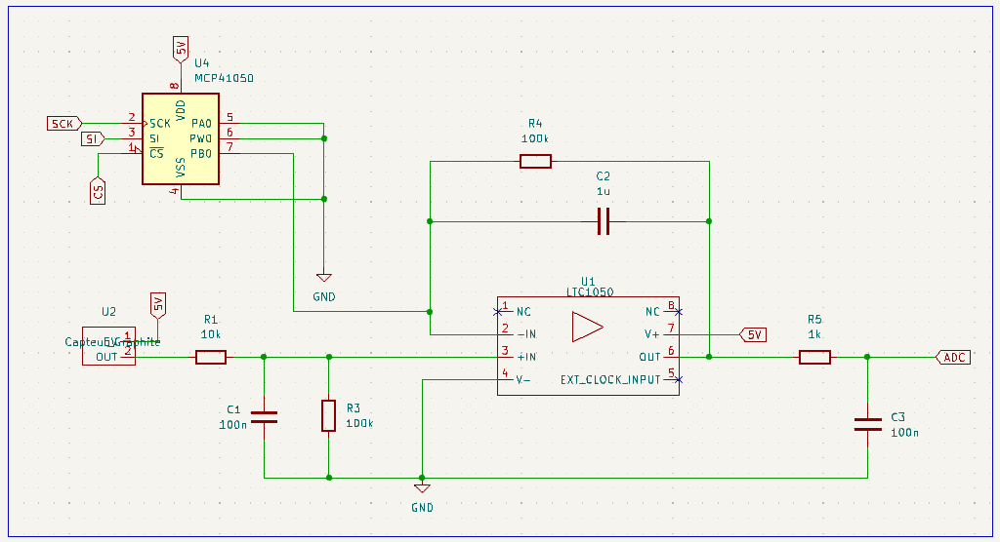

Afin d'optimiser les capacités de mesure et de comparaison de notre capteur graphite, nous avons intégré plusieurs composants supplémentaires :

- GrapheSenso (notre capteur graphite) pour mesurer les variations de résistance.
- Un flex sensor commercial servant de référence pour comparer les résultats.

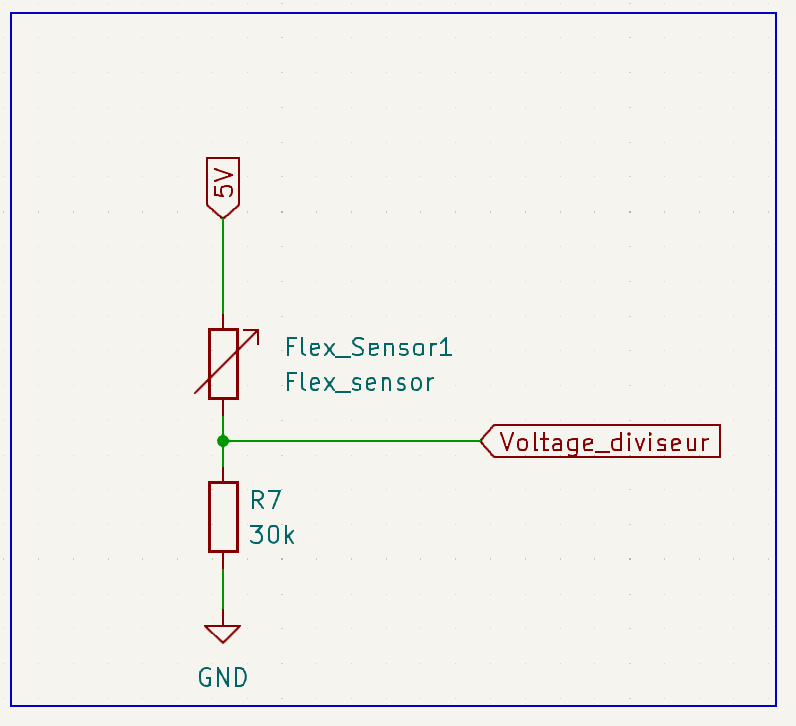

- Un module Bluetooth HC-05 pour établir une communication sans fil avec une application mobile dédiée.
- Un écran OLED pour visualiser les mesures en temps réel.
- Un encodeur rotatif pour basculer facilement entre les deux capteurs dans l'interface de l'application.

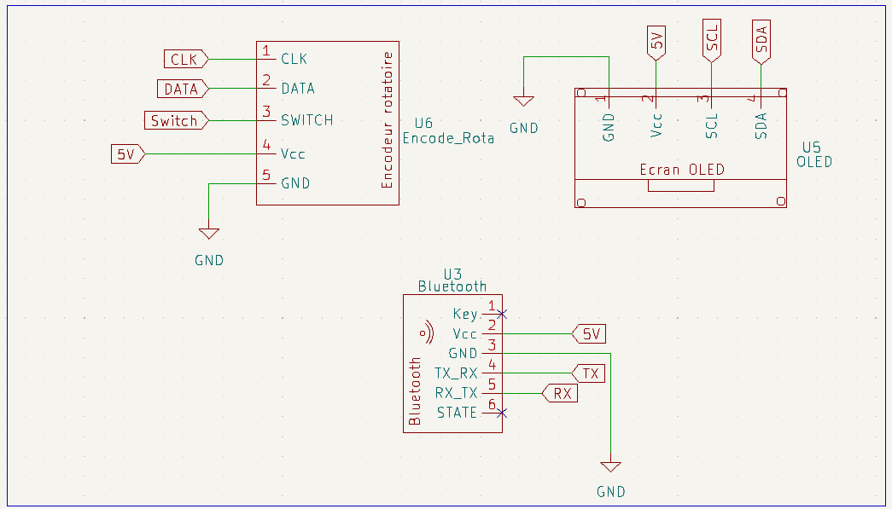

Tous ces composants ont été soigneusement disposés sur un shield Arduino UNO pour faciliter l'intégration et l'utilisation.

La première étape de la conception du PCB a consisté à créer les symboles des différents composants et à reproduire le schéma électrique complet dans KiCad. Le schéma final intègre tous les éléments mentionnés ci-dessus.

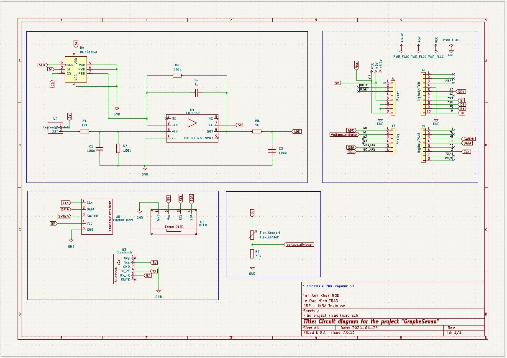

Ensuite, nous avons réalisé les empreintes des composants pour les placer sur le PCB. L'un des défis majeurs a été d'optimiser le placement pour éviter les vias, en particulier pour la connexion à la masse (GND). Le résultat final est un PCB compact et fonctionnel.

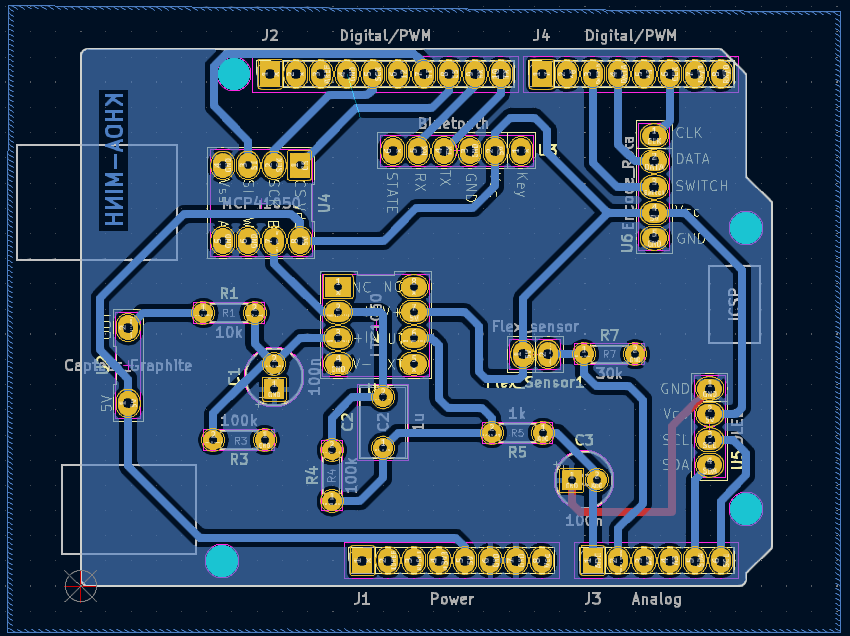

Une visualisation 3D du PCB a été générée pour vérifier le routage et l'agencement des composants. Cette étape a permis de s'assurer de la faisabilité de la fabrication du PCB.

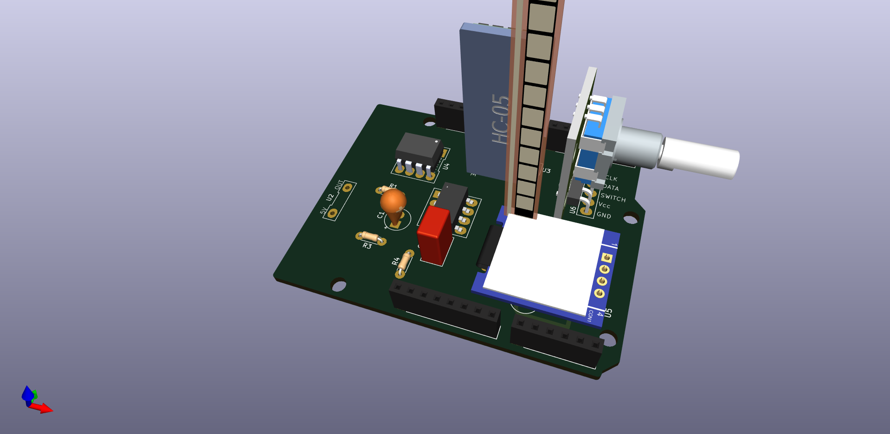

Toutes les ressources utilisées pour la conception du PCB, y compris les empreintes, le schéma et les fichiers de conception, sont disponibles dans notre dossier KiCad.

## Code Arduino

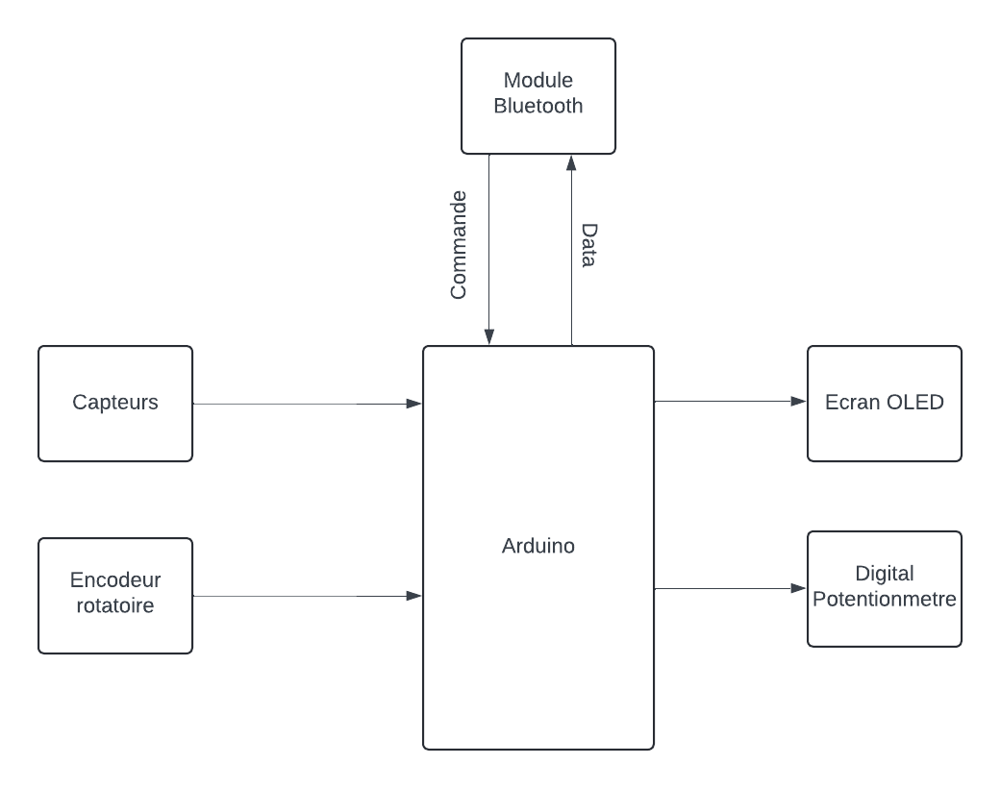
&nbsp;&nbsp;&nbsp;&nbsp;&nbsp;&nbsp;Notre [programme Arduino](Arduino/Projet_Capteur_Final.ino) permet de mesurer la résistance du capteur en graphène et du flex sensor en convertissant les valeurs de tension obtenues par l'ADC de l'Arduino. Les valeurs de résistance sélectionnées sont ensuite affichées sur l'écran OLED, la sélection étant contrôlée par l'encodeur rotatif.

&nbsp;&nbsp;&nbsp;&nbsp;&nbsp;&nbsp;Le programme établit également une communication bidirectionnelle entre le module Bluetooth et l'application mobile. Des protocoles spécifiques ont été mis en place pour gérer l'échange de données et de commandes. Le module Bluetooth reçoit les instructions de l'application mobile, telles que la demande de données ou le réglage de la résistance du potentiomètre numérique, et transmet les données mesurées en retour.

&nbsp;&nbsp;&nbsp;&nbsp;&nbsp;&nbsp;Une fonctionnalité notable de notre programme est la possibilité de régler le gain de l'amplificateur en modifiant la valeur de résistance du potentiomètre numérique via l'interface de l'application mobile. Cette flexibilité permet d'adapter le système à différentes conditions de mesure.

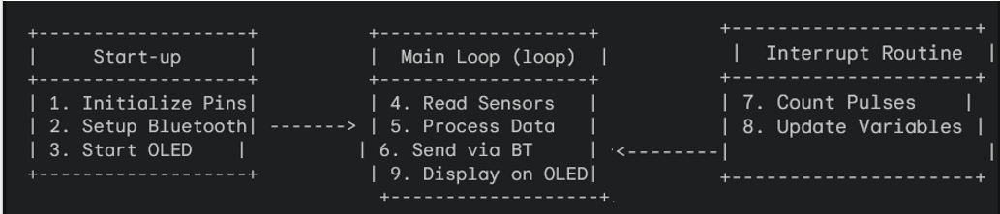

## Application android APK sous MIT App Inventor
&nbsp;&nbsp;&nbsp;&nbsp;&nbsp;&nbsp;Une application est également disponible avec le dispositif : développé sous [MIT App Inventor](https://appinventor.mit.edu/) . 

&nbsp;&nbsp;&nbsp;&nbsp;&nbsp;&nbsp;L'application reçoit les données transmis par le module bluetooth HC-05. Elle affiche ensuite la valeur tranmis (des $M\ohm$ pour le capteur graphite ou des $\ohm$ pour le flex sensor.

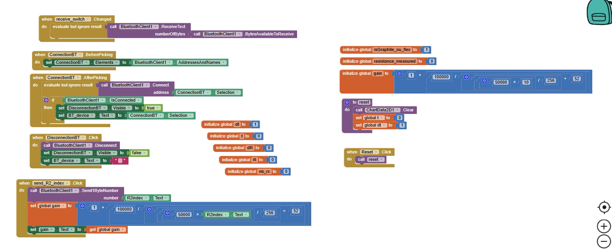

&nbsp;&nbsp;&nbsp;&nbsp;&nbsp;&nbsp;L'application peut s'installer [sous android ici](apk/First_application_copy.apk) et toutes les informations liées à l'application son dans [le dossier Application Android](apk)

## Réalisation du shield

&nbsp;&nbsp;&nbsp;&nbsp;&nbsp;&nbsp;Dans le cadre de notre projet, nous avons réalisé la fabrication d'un circuit imprimé (PCB) au sein des départements de Génie Électrique et Informatique et de Génie Physique de l'INSA Toulouse. Après avoir conçu le circuit sur le logiciel KICAD, nous avons confié l'impression à Cathy.

&nbsp;&nbsp;&nbsp;&nbsp;&nbsp;&nbsp;Le processus de fabrication a débuté par l'impression de notre modèle sur du papier calque, qui a ensuite servi de masque pour l'insolation UV d'une plaquette d'époxy cuivrée. L'exposition aux UV a duré une dizaine de minutes, après quoi la résine non exposée a été éliminée à l'aide d'un révélateur. La plaquette a ensuite été plongée dans un bain de perchlorure de fer pendant 7 à 9 minutes pour dissoudre le cuivre non protégé, révélant ainsi les pistes du circuit. Un rinçage à l'acétone a finalisé le processus, nous permettant d'obtenir un PCB conforme à notre conception initiale.

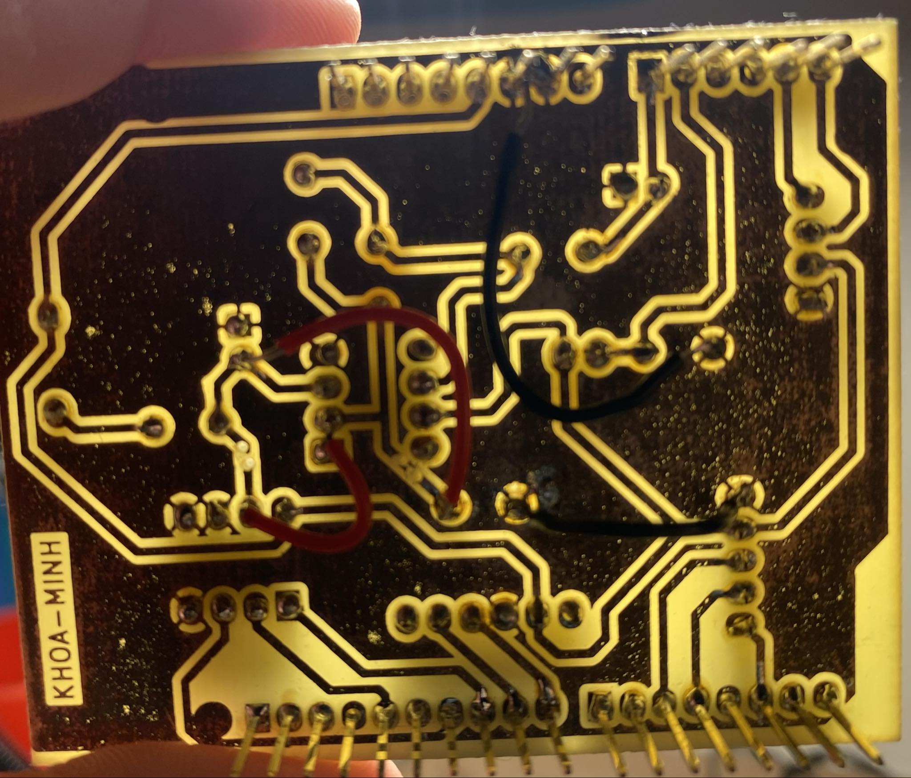

&nbsp;&nbsp;&nbsp;&nbsp;&nbsp;&nbsp;Une fois le PCB fabriqué, nous avons procédé à son assemblage. Cela a nécessité le perçage de trous de deux tailles différentes, 0,8 mm et 1 mm, selon les spécifications de notre projet KICAD. Les trous de 0,8 mm ont été utilisés pour les composants tels que les AOP LTC1050, les résistances et les condensateurs, tandis que les trous de 1 mm ont servi pour les broches de connexion de l'Arduino Uno et les headers des modules OLED, Bluetooth et encodeur rotatif. Après le perçage, nous avons soudé les composants en place à l'aide d'étain pour garantir des connexions électriques solides.

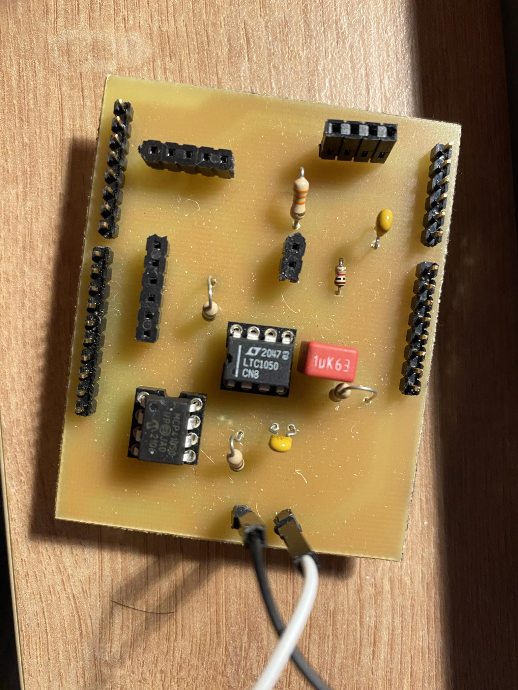

&nbsp;&nbsp;&nbsp;&nbsp;&nbsp;&nbsp;Nous tenons à remercier chaleureusement Cathy pour son aide précieuse dans la réalisation de notre PCB. Son expertise et son soutien ont été essentiels pour mener à bien cette étape cruciale de notre projet.

## Banc de test

&nbsp;&nbsp;&nbsp;&nbsp;&nbsp;&nbsp;Afin de caractériser notre capteur et son montage transimpédance, nous avons opté pour des demi-cercles imprimés en 3D de diamètres croissants (de 2 cm à 5 cm par incréments de 0,5 cm). Cette configuration nous permet d'évaluer l'évolution de la résistance électrique en fonction de la déformation appliquée.

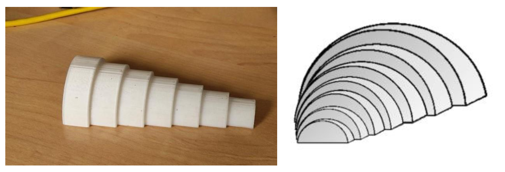

&nbsp;&nbsp;&nbsp;&nbsp;&nbsp;&nbsp; Grâce à ces demis-cercles, nous allons pouvoir calculer la variation de la résistance électrique $\frac{\Delta R}{R_0}$ en fonction de la déformation $\epsilon=\frac{e}{D}$. Nous avons ici mesuré notre épaisseur de notre papier $e=0.2 mm$. ALes mesures effectuées sur papier d'épaisseur constante (0,1 mm pour le plus petit diamètre, 0,04 mm pour le plus grand) révèlent des courbes caractéristiques distinctes pour les crayons 2B, B et HB, en tension comme en compression.

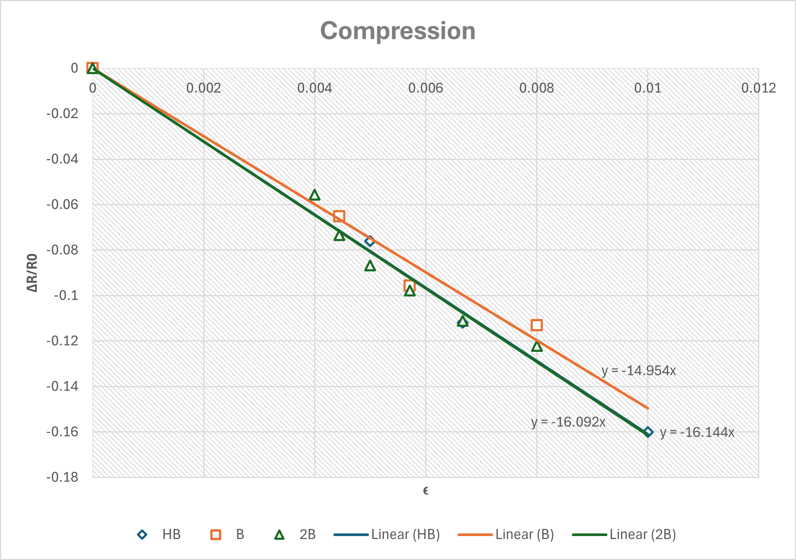

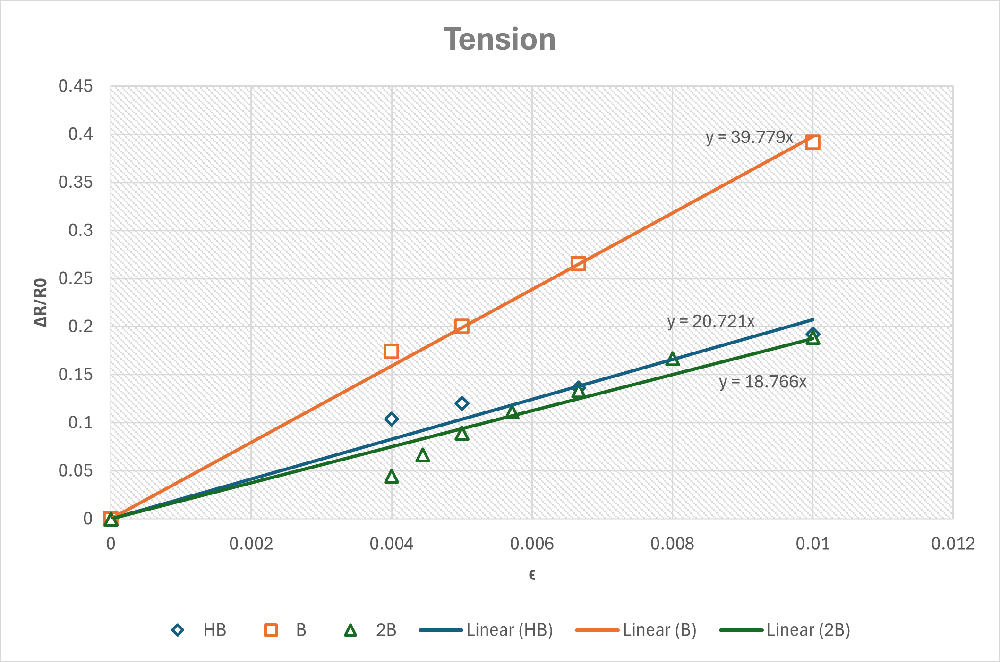

&nbsp;&nbsp;&nbsp;&nbsp;&nbsp;&nbsp;Nous observons une augmentation de la résistance en tension (éloignement des atomes de carbone) et une diminution en compression (rapprochement des atomes). De plus, la variation relative de résistance est inversement proportionnelle à la quantité de carbone présente dans le crayon (2H < H < HB < B < 2B).

&nbsp;&nbsp;&nbsp;&nbsp;&nbsp;&nbsp;Contrairement aux travaux de Cheng-Wei Lin et al. ("Pencil Drawn Strain Gauges and Chemiresistors on Paper"), nous avons réussi à mesurer la résistance avec un crayon 2H.

&nbsp;&nbsp;&nbsp;&nbsp;&nbsp;&nbsp;En comparaison avec un capteur de flexion commercial, notre dispositif semble moins sensible et moins résistant aux fortes déformations, limitant son nombre d'utilisations, cependant, ils peuvent être utilisés dans deux directions, ce qui constitue une nette amélioration par rapport aux capteurs commerciaux utilisés dans une seule direction.

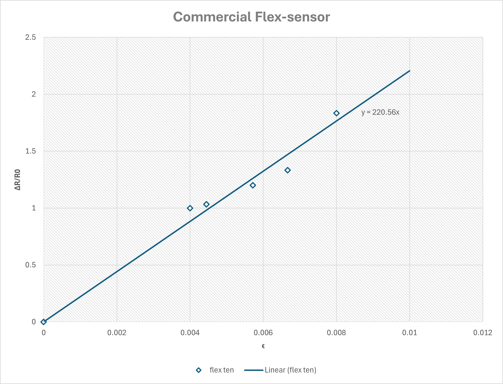

&nbsp;&nbsp;&nbsp;&nbsp;&nbsp;&nbsp;Il est important de noter que ces résultats sont à interpréter avec prudence, compte tenu des conditions expérimentales variables (quantité de graphite déposée, méthode de déformation).

&nbsp;&nbsp;&nbsp;&nbsp;&nbsp;&nbsp;Pour améliorer la reproductibilité, nous recommandons l'utilisation d'un servo-moteur pour contrôler précisément la déformation et la quantité de graphite déposée. Alternativement, des cercles de diamètres connus pourraient être reproduits avec des déformations plus faibles pour préserver l'intégrité du capteur.

## Datasheet

&nbsp;&nbsp;&nbsp;&nbsp;&nbsp;&nbsp; Vous pouvez retrouver la datasheet du produit [ici](datasheet/Datasheet-GrapheSenso.pdf).

## Contact

&nbsp;&nbsp;&nbsp;&nbsp;&nbsp;&nbsp;Vous pouvez nous contacter pour toutes questions :
- Tan Anh Khoa NGO : takngo@insa-toulouse.fr
- Le Duc Minh TRAN : ltra@insa-toulouse.fr
